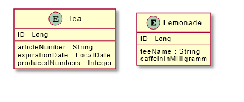

# Or-Mapping mit JDBC

## Übersicht

Eine kleine Aufgabe von der Schule, die einen Einblick in JDBC verschafft.
Datenbank connection mit sqlite. 

## Starte meinen Java Mapper

    git clone https://github.com/Zeljko-Predjeskovic/JDBC_OR-Mapping.git

    mvn clean

    mvn install

## Models

Eigentlich ziemlich unnötig für zwei Entities xDD:

## Wichtige Pom.xml dependencies und plugins

        <properties>
            <java.version>15</java.version>
            <maven.compiler.source>15</maven.compiler.source>
            <maven.compiler.target>15</maven.compiler.target>

        </properties>
    
        <build>
            <plugins>
                <plugin>
                    <groupId>org.apache.maven.plugins</groupId>
                    <artifactId>maven-compiler-plugin</artifactId>
                    <configuration>
                        <source>10</source>
                        <target>10</target>
                    </configuration>
                </plugin>
                <plugin>
                    <groupId>org.asciidoctor</groupId>
                    <artifactId>asciidoctor-maven-plugin</artifactId>
                    <version>${asciidoctor.maven.plugin.version}</version>
                </plugin>
            </plugins>
        </build>
    
        <dependencies>
            <dependency>
                <groupId>org.junit.jupiter</groupId>
                <artifactId>junit-jupiter-api</artifactId>
                <version>5.7.0</version>
                <scope>test</scope>
            </dependency>
            <dependency>
                <groupId>org.junit.jupiter</groupId>
                <artifactId>junit-jupiter-engine</artifactId>
                <version>5.7.0</version>
                <scope>test</scope>
            </dependency>
            <dependency>
                <groupId>org.mockito</groupId>
                <artifactId>mockito-core</artifactId>
                <version>3.6.0</version>
                <scope>test</scope>
            </dependency>
            <dependency>
                <groupId>org.assertj</groupId>
                <artifactId>assertj-core</artifactId>
                <version>3.18.1</version>
                <scope>test</scope>
            </dependency>
            <dependency>
                <groupId>org.xerial</groupId>
                <artifactId>sqlite-jdbc</artifactId>
                <version>3.34.0</version>
            </dependency>
        </dependencies>
